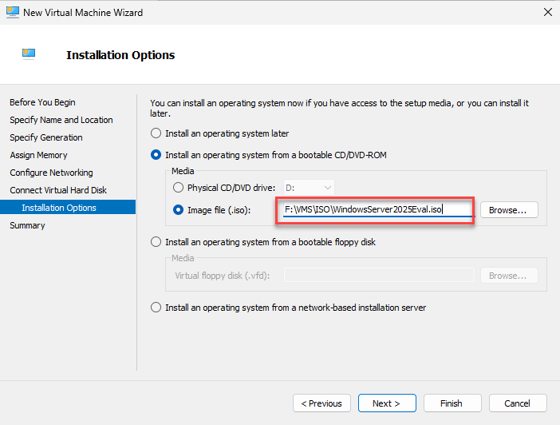

# 🚀 Azure Hyper-V Lab

Welcome to the **Azure Hyper-V Lab**! This project provides an Azure IaaS VM Deployment Template for **Windows Server 2025 Datacenter Edition** with the **Hyper-V Role** enabled. Whether you're experimenting, learning, developing proofs of concept, or setting up a staging environment, this template simplifies the process and empowers you to leverage Hyper-V in Azure.

---

## 🌟 What's Included?

### Infrastructure:
- **Virtual Network (VNet)** with a single Subnet
- **Static Public IP** (Standard SKU)
- **Network Security Group (NSG)** configured for Remote Desktop access
- **Virtual Machine** with Nested Virtualization capabilities ([Learn more](https://www.markou.me))
- **Premium SSD Disks**:
  - 127GB for the Operating System
  - 512GB for storing Virtual Machines

### Server Roles:
- **Hyper-V**
- **DHCP Server**
- **RSAT Tools**
- **Containers**

### Pre-Installed Software:
- **Azure Az PowerShell Module**
- **Azure CLI**
- **Azure Storage Explorer**
- **AzCopy Utility**
- **PowerShell Core**
- **Windows Admin Center**
- **7-Zip**
- **Chocolatey Package Manager**
- **Evaluation copy of Windows Server 2025**

---

## 🚀 Get Started

### 1. Deploy the Template
Click the button below to deploy the template directly in the Azure Portal:

### 2. Fill in the Required Information
Provide the necessary details in the Azure Portal.

### 3. Sit Back and Relax ☕
The deployment takes approximately 30 minutes.

### 4. Connect to Your Hyper-V VM
Use **Remote Desktop** to connect to the newly deployed VM.

### 5. Manage Hyper-V Server
Start managing Hyper-V using **Hyper-V Manager** or **Windows Admin Center**.

### 6. Spin up Guest OS
Start creating Windows Server 2025 Guest OSes using the ISO file stored under `F:\VMS\ISO`.

---

## 📝 General Notes

- A wide range of VM sizes is pre-configured in the template to avoid deployment errors.
- The VM uses **Azure Spot Instances** with an eviction policy set to `deallocate`.
- Use the **Microsoft Evaluation Center** desktop shortcut to evaluate Microsoft software and operating systems.
- Learn how to deploy VMs using Azure Marketplace Images on my [blog](https://www.markou.me/2022/03/use-azure-marketplace-images-to-deploy-virtual-machines-on-azure-stack-hci/).
- **Default Paths**:
  - VM configuration files: `F:\VMS`
  - VM disks: `F:\VMS\Disks`
- **Enhanced Session Mode** is enabled.
- A **DHCP Scope** is configured to provide network addressing for VMs.
- An **Internal Hyper-V Switch** with NAT enabled is included.
- The data disk (`Volume F`) is formatted with **ReFS** and a unit size of 64KB.
- Both **JSON** and **Bicep Templates** are available in this repository.
- **Configuration Files**:
  - [DSC Configuration File](dsc/DSCInstallWindowsFeatures.ps1)
  - [Host Configuration File](/HostConfig.ps1)

---

## 📚 Learn More About Hyper-V

- [Windows Server Hyper-V and Virtualization Learning Path](https://docs.microsoft.com/en-us/learn/paths/windows-server-hyper-v-virtualization/) on Microsoft Learn
- [Markou.me Hyper-V Blog](https://www.markou.me/category/hyper-v/)
- [Virtualization Blog](https://techcommunity.microsoft.com/t5/virtualization/bg-p/Virtualization)
- [MSLab GitHub Project](https://github.com/microsoft/MSLab)
